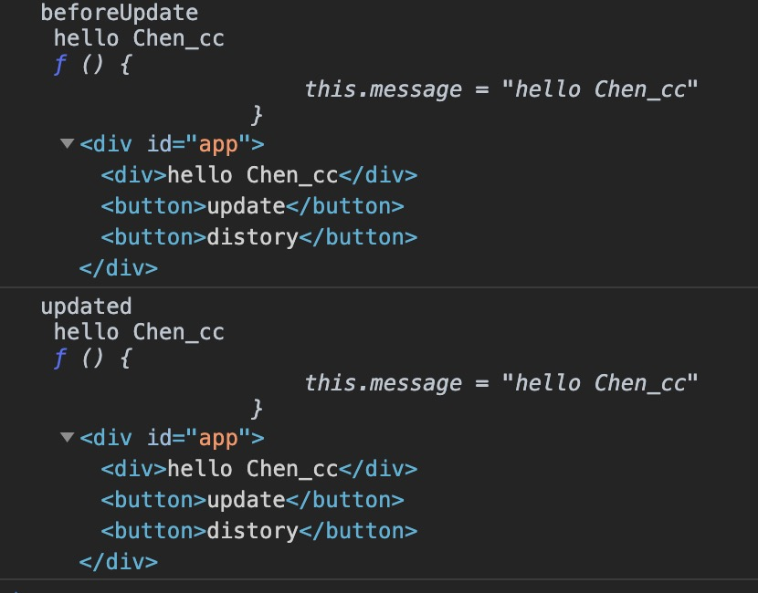

## 什么是生命周期

在 Vue 渲染一块页面内容时，会有以下几个过程:

1. 解析语法生成 AST(Abstract Syntax Tree)抽象语法树
2. 根据 AST 结果，完成 data 数据初始化。
3. 根据 AST 结果和 data 数据绑定情况，生成虚拟 DOM.
4. 将虚拟 DOM 生成真正的 DOM 插入到页面中，此时页面会被渲染。

当对绑定的数据进行更新的时候，又会产生如下这些过程:

5. 框架接收到数据变更的事件，根据数据生成新的虚拟 DOM 树。比较新旧两棵虚拟 DOM 树，得到差异。
6. 把差异应用到真正的 DOM 树上，即根据差异来更新页面内容。

当我们清空页面内容时，还有:

7. 注销实例，清空页面内容，移除绑定事件、监听器等。


下面这张周期图就可以很直观的解释这些生命钩子


## 构建实例

来吧直接上代码

```bash
<!DOCTYPE html>
<html lang="en">

<head>
	<meta charset="UTF-8">
	<meta name="viewport" content="width=device-width, initial-scale=1.0">
	<script src="https://cdn.jsdelivr.net/npm/vue/dist/vue.js"></script>
	<title>Document</title>
</head>

<body>
	<div id="app">
		<div>{{message}}</div>
		<button @click="update">update</button>
		<button @click="distroy">distroy</button>
	</div>
	<script>
		var app = new Vue({
			el: '#app',
			data: {
				message: 'hello Vue'
			},
			methods: {
				update: function () {
					this.message="hello Chen_cc"
				},
				distroy:function(){
					app.$destroy()
				}
			},
			beforeCreate: function () {
				console.log("beforeCreate", this.message, this.update, this.$el);
			},
			created: function () {
				console.log("created", this.message, this.update, this.$el);
			},
			beforeMount: function () {
				console.log("beforeMount", this.message, this.update, this.$el);
			},
			mounted: function () {
				console.log("mounted", this.message, this.update, this.$el);
			},
			beforeUpdate: function () {
				console.log("beforeUpdate", this.message, this.update, this.$el);
			},
			updated: function () {
				console.log("updated", this.message, this.update, this.$el);
			},
			beforeDestroy: function () {
				console.log("beforeDestroy", this.message, this.update, this.$el);
			},
			destroyed: function () {
				console.log("destroyed", this.message, this.update, this.$el);
			}
		})
	</script>
</body>

</html>
```

页面中我们可以看到输出结果，验证了前4个生命周期的data、methods、DOM 挂载等情况


- beforeCreate : 初始化实例前，data、methods 等不可获取
- created : 实例初始化完成，此时可获取 data 里数据和 methods 事件，无法获取 DOM
- beforeMount : 虚拟 DOM 创建完成，此时未挂载到页面中，vm.\$el 可获取未挂载模板
- mounted : 数据绑定完成，真实 DOM 已挂载到页面，vm.\$el 可获取真实 DOM

当点击update按钮时，date发生了改变



- beforeUpdate : 数据更新，DOM Diff 得到差异，未更新到页面
- updated : 数据更新，页面也已更新

点击destroy按钮，beforeDestroy和destroyed被触发，这时再点击update按钮，数据也不发生改变。


- beforeDestroy : 实例销毁前，在这一步，实例仍然完全可用
- destroyed : 实例销毁完成，实例指示的所有东西都会解绑定，所有的事件监听器会被移除，所有的子实例也会被销毁

## 参考
- [Vue.js](https://cn.vuejs.org/index.html)
