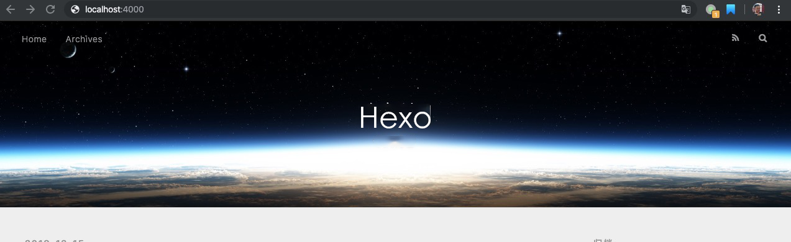
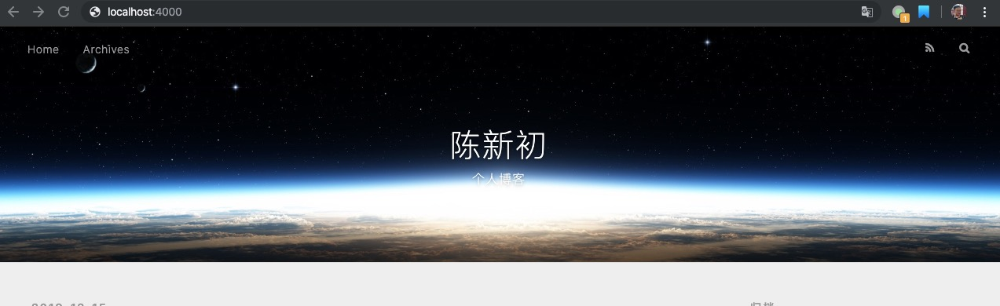
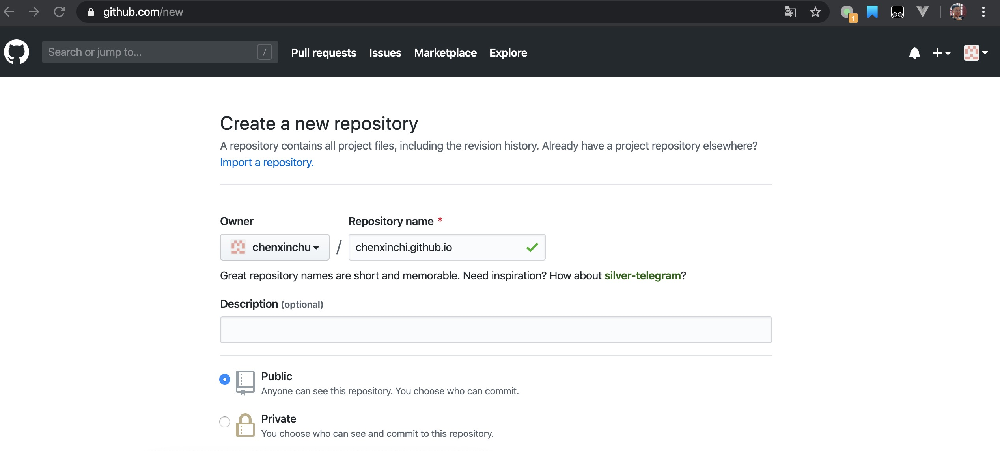
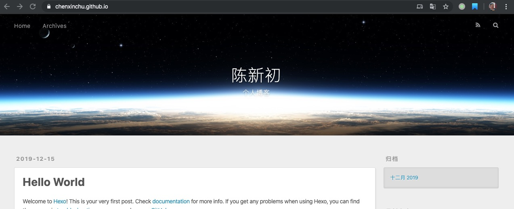

Hexo博客框架是目前十分火爆的博客框架，它操作简单，维护方便，网上教程十分丰富，是新手程序员搭建博客的不二之选。利用 Hexo + GitHubPage 可以让你短时间内迅速搭建起自己的博客。


## 准备工作
工欲善其事，必先利其器。拥有良好的开发工具往往能使你事半功倍。

这里用到的工具是[nodejs](https://nodejs.org/en/)，下载自己适合的版本安装。

nodejs中有一个东西叫npm包管理器，这个是搭建Hexo所必须的东西。

打开终端检查node和npm是否安装成功。
```bash
node -v
npm -v
```


## 安装Hexo
全局安装Hexo
```bash
npm install -g hexo-cli
```
同样用`hexo -v`来检查是否安装成功。
```bash
hexo -v
```


## 搭建Hexo
创建一个新的文件夹并进入，命名为blog。这个文件夹用于存放搭建博客的所有文件。
```bash
mkdir blog
cd blog
```

开始初始化博客，输入`hexo init`初始化博客。成功之后会提示你:`Start blogging with Hexo`。如果命令不成功，可能是权限的问题，在命令前脚上sudo即可。
```bash
hexo init
``` 

到目前为止，hexo博客已经安装完成。输入`ls -la`查看文件这时你会发现blog文件夹下生成了很多文件。
```bash
ls -la
``` 
其中`_config.yml`是博客的配置文件，`source`存放博客内容，`themes`是博客主题风格。

接下来我们开始启动博客，输入hexo server，在本地的4000端口就生成了你的博客。打开浏览器输入：`http://localhost:4000`就可以直接访问你的博客。
```bash
$ hexo s
INFO STart processing
INFO  Hexo is running at http://localhost:4000 . Press Ctrl+C to stop.
```



## 修改个人信息

先按Ctrl+C终止运行。

编辑_config.yml文件。
```bash
sudo vim _config.yml
```

按i进入输入模式，修改Site信息,设置博客的基本信息。

```bash
# Site
title: 陈新初
subtitle: 个人博客
author: Chen CC
language: zh-CN
timezone: ''
```
修改完成后按esc健，再按:wq保存并退出。

修改Writing信息:`post_asset_folder: true`,允许写博客时插入图片。输入命令，安装`hexo-asset-image`插件
```bash
npm install https://github.com/CodeFalling/hexo-asset-image --save
```

再次输入`hexo s`,
刷新`localhost:4000`,信息修改成功

 


## GitHub部署博客

博客已经创建成功了，但不可能总在本地访问自己的博客，我们需要把它部署到远端，让别人也能看到。

打开浏览器搜索GitHub。完成注册后新建一个仓库，仓库命名为：Owener.github.io，例如我的命名是：chenxinchu.github.io，点击Create。这里的命名不能随便改，必须符合规范。


回到终端,在blog目录下部署git，git是一个版本管理工具。
```bash
npm install --save hexo-deployer-git
```

安装完成之后继续设置_config.yml
```bash
vim _config.yml
```
修改Deployment，repo修改为你仓库的地址 `https://github.com/Owener/Owener.github.io.git`
```bash
# Deployment
## Docs: https://hexo.io/docs/deployment.html
deploy:
  type: git
  repo: https://github.com/chenxinchu/chenxinchu.github.io.git
  branch: master
```

config文件修改完成后，我们将本地文件部署到远端
```bash
hexo d
```

输入GitHub账号和密码后，即部署成功。回到自己的GitHub仓库，仓库此时多了很多文件。

在浏览器中输入`Owener.github.io`，我这里输入的是`chenxinchu.github.io`。点击刷新，你就会发现你的博客已经成功部署到GitHub上了。

