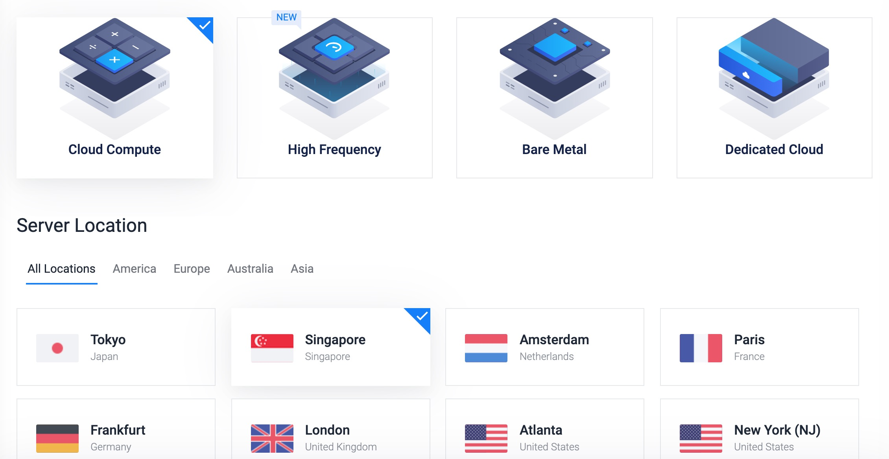
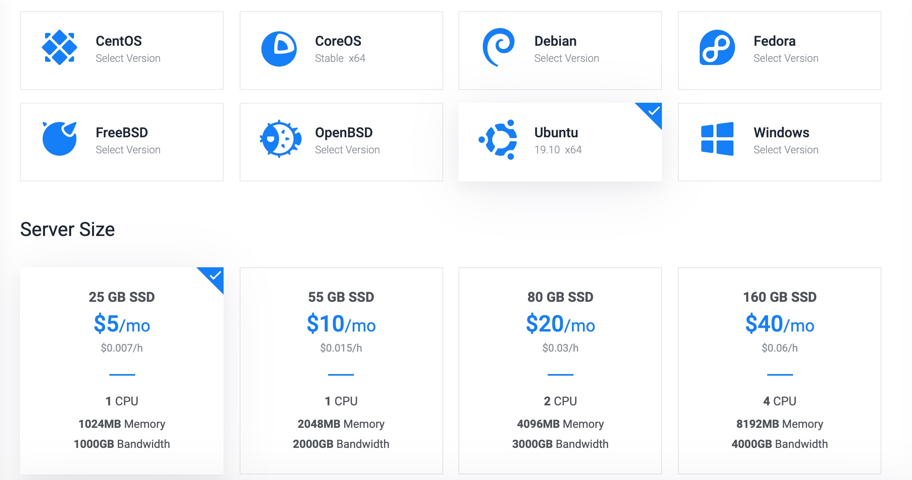
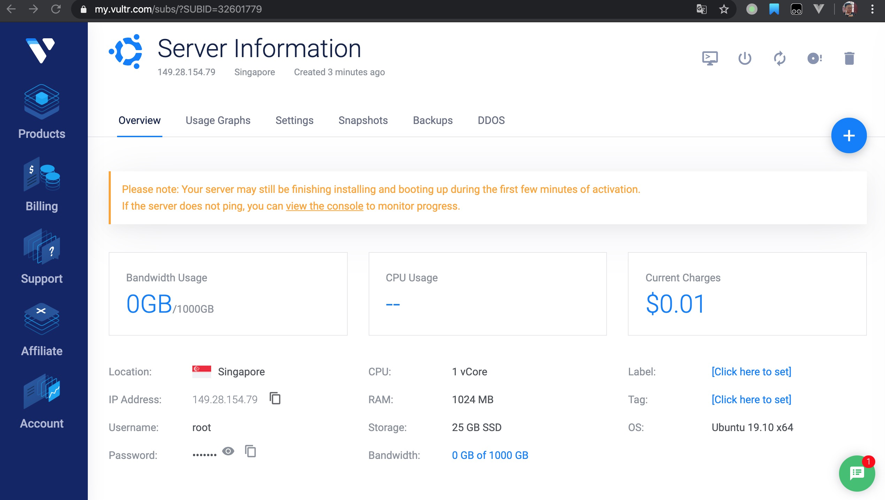
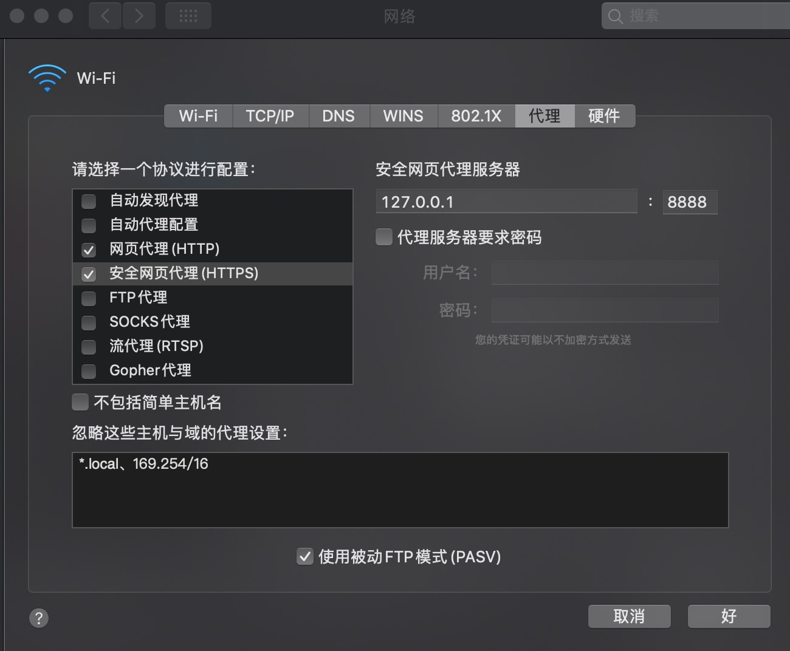
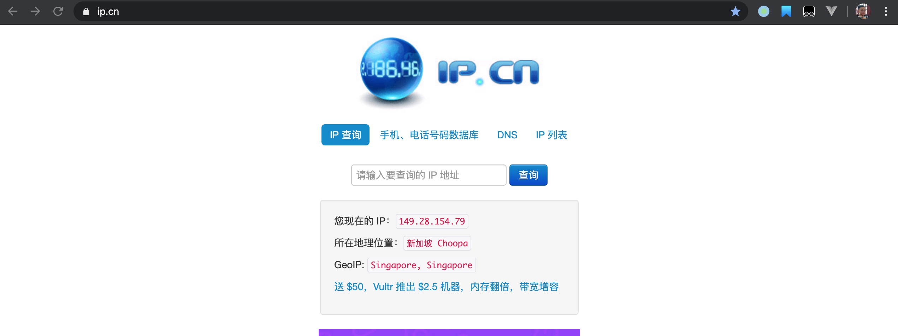

## 前言 
从事计算机的小伙伴都知道Google的重要性，但由于很多因素，我们访问不了这些网站。很多小伙伴选择折腾免费的VPN或者SSH，最后花费了很多时间也没有找到靠谱的梯子。
这里我介绍一种比较划算的方法，用自己的VPS实现科学上网。

## 工具
+ [autossh](https://www.harding.motd.ca/autossh/)
反向代理，它能使ssh隧道更加稳定

+ [tinyproxy](http://tinyproxy.github.io/)
  一款轻量级的http/https代理，快速小巧，十分方便

## 购买并新建一个服务器
这里推荐的是国外的[Vultr](https://www.vultr.com/?ref=8379466-6G),它速度快、价格合理、节点多、性能稳定。足够个人或小团队使用。

进入Vultr官网，完成注册和充值。

新用户还可享充10$送50$活动。


点击加号新建一个服务器实例。选择Cloud Compute，Singgapore(新加坡延时低)，Ubuntu，$5。


其他的不用管，完成后点击Deploy Now。

稍等一会儿，Vultr就会为我们创建一台服务器。

记住这个IP，打开终端，先测试这个IP是否被封,出现下面的情况就表示成功了。
如果没有ping成功，按之前的方法，再次新建一个服务器，直到ping通，再把原有的服务器删除。
注意：这里不能先删除再新建，否者很有可能拿到同样的IP。
```bash
ping 149.28.154.79
PING 149.28.154.79 (149.28.154.79): 56 data bytes
64 bytes from 149.28.154.79: icmp_seq=0 ttl=48 time=397.387 ms
64 bytes from 149.28.154.79: icmp_seq=1 ttl=48 time=293.818 ms
```
## 远程连接并部署服务器
终端输入ssh-keygen一路回车,出现以下提示表示成功。
```bash
ssh-keygen

The key's randomart image is:
+---[RSA 2048]----+
|  .....+=*+o+ oBO|
|   .   o+.o..+oB*|
|  .   . .  ...o.O|
|   .   o   . ..X.|
|.   .   S +   . *|
| E .     + . . ..|
|  .       .   + .|
|             . . |
|                 |
+----[SHA256]-----+
```
输入ssh-copy-id 149.28.154.79，输入密码后看到以下提示表示成功。
```bash
ssh-copy-id root@149.28.154.79

root@149.28.154.79's password: 

Number of key(s) added:        1

Now try logging into the machine, with:   "ssh 'root@149.28.154.79'"
and check to make sure that only the key(s) you wanted were added.
```
接着我们用ssh root@149.28.154.79登陆服务器,你会发现不需要输入密码就能登陆服务器。
```bash
ssh root@149.28.154.79

[root@vultr ~]# 
```
安装tinyproxy。在服务器中输入yum install -y tinyproxy。
```bash
[root@vultr ~]# apt-get install tinyproxy
```
编辑文件在Listen处添加Listen 127.0.0.1。这里的配置在`http://tinyproxy.github.io/`上有详细的解释，我就不赘述了。
```bash
[root@vultr ~]# vim /etc/tinyproxy/tinyproxy.conf

# Listen: If you have multiple interfaces this allows you to bind to
# only one. If this is commented out, tinyproxy will bind to all
# interfaces present.
#
#Listen 192.168.0.1
Listen 127.0.0.1
```
退出服务器，在本地安装autossh。windows用户可以用npm 或者wget 安装。
```bash
brew install autossh
```
安装完成后输入下面的命令即可。
-M 表示指定监视端口 0关闭监视循环，-N 表示不执行远端命令，-f 表示后台运行，-L 绑定端口。
```bash
autossh -M 0 -N -f -L 127.0.0.1:8888:127.0.0.1:8888 root@149.28.154.79
```
打开“设置->网络->高级->代理”，在http和https代理中填入127.0.0.1:8888。


打开浏览器输入`ip.cn`,你会发现你的你已经在国外了。


## 总结
本次实现科学上网的原理其实很简单，国外的服务器 + 代理工具，实现简单的反向代理。

一些细节性的问题我没有解释的很清楚，比如autossh和tinyproxy的具体细节，它不能三五句话解释情况，大家可以去看autossh和tinyproxy的文档。
